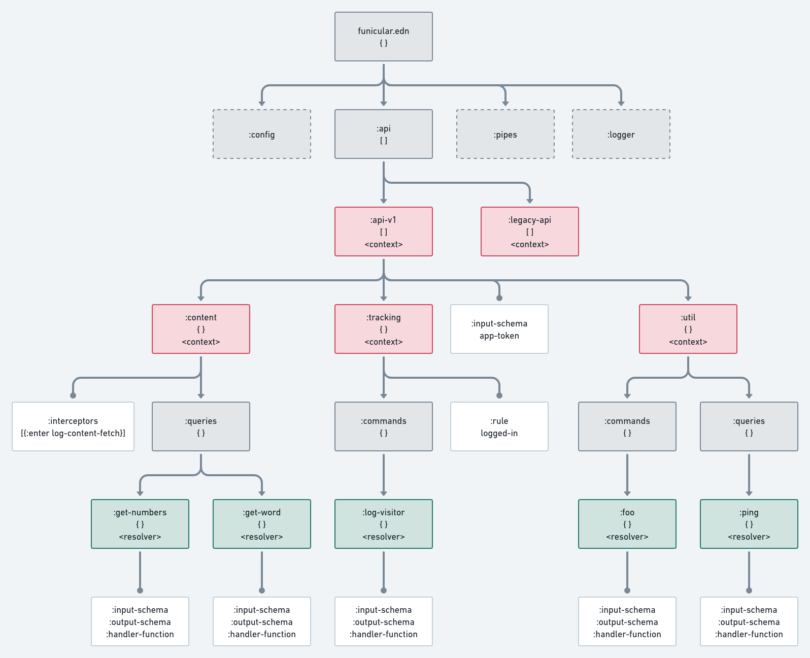

Because fun is mandatory. For everyone.

- [Introduction](#introduction)
- [`funicular.edn`](#funicularedn)
  - [Document structure](#document-structure)
    - [Context nodes](#context-nodes)
    - [Resolver nodes](#resolver-nodes)
    - [Config nodes](#config-nodes)
    - [Pipes](#pipes)
  - [License](#license)

# Introduction

Funicular is a tool for tight integration of **Clojure full stack** (backend+frontend) apps. The central piece of this integration is the `funicular.edn` schema file.

It's a **tree-like schema** file that acts as a **contract** between backend and frontend parts of the app by defining all the **commands and queries** that the backend system exposes to the frontend, along with a **handler function** and the **input and output [Malli schemas](https://github.com/metosin/malli)** for every particular command and query (`fn + schemas = resolver`).

Resolver nodes can be nested under context nodes that are used to define additional validation rules - you can define an input schema that is going to be validated before going deeper down the tree or an output schema that is going to be validated against the return value.

The execution model is based on **[Sieppari](https://github.com/metosin/sieppari) [interceptors](https://quanttype.net/posts/2018-08-03-why-interceptors.html)**. Every resolver node and context node in the schema file is transformed into an interceptor during the compilation phase while preserving the execution order by traversing and compiling the tree-like schema file into a flat list of `:enter` and `:leave` interceptors. These interceptors are then executed sequentially.

**Each command and query maps to exactly one resolver function**, before or after which multiple interceptors can be ran.

# `funicular.edn`

An example of a document with 2 queries and 2 commands:

```clojure
{:api
 [:api-v1
  [:content
   {:interceptors [{:enter log-content-fetch}]
    :queries
    {:get-numbers
     {:input-schema :int
      :output-schema [:vector :int]
      :handler (fn [{times :data}] (vec (range times)))}
     :get-words
     {:input-schema :app/seed
      :output-schema :app/generated-words
      :handler (fn [{times :data}] (mapv make-word (range times)))}}}
   [:<>
    {:rules        logged-in?
     :commands     {}
     :queries
     {:get-stats
      {:input-schema  :any
       :output-schema [:vector :int]
       :handler       (fn [{times :data}] (vec (range times)))}}}]]
  [:tracking
   {:rules logged-in?
    :commands
    {:log-visitor
     {:input-schema :any
      :output-schema :int
      :handler (fn [data] (log-site-visit data))}}}]
  [:util
   {:queries
    {:foo
     {:input-schema :any
      :output-schema :string
      :handler (fn [_] :bar)}}
    :commands
    {:ping
     {:input-schema :any
      :output-schema [:fn #(= % :pong)]
      :handler (fn [_] :pong)}}}]]}
```

To run these queries and commands, you send a request like below:

```clojure
(ns app.funicular-example
  (:require [com.verybigthings.funicular.core :as fun]
            [clojure.edn :as edn]))

(let [raw-edn (edn/read-string (slurp (io/resource "funicular.edn")))
      compiled (fun/compile api)]
  (fun/execute compiled
               {}
               {:command [:api-v1.tracking/log-site-visitor
                          {:page "/content"}]
                :queries {:numbers
                          [:api-v1.content/make-numbers 3]
                          :words
                          [:api-v1.content/make-words 3]}}))
```

As can be seen in the code above, you can run multiple queries but only command in the same request.

## Document structure

The document above can be represented visually as follows:



As can be seen on the image above, there are 4 main types of nodes in the EDN document, mainly:
* **document structure / config** (gray, `:api`, `:commands`, `:queries`) - document sections with specific purposes
* **context** (red, `:api-v1`, `:tracking`, `:util`) - nodes that group related API functions - used for semantic (contextual) grouping
* **resolver** nodes (green, `:get-numbers`, `:log-visitor`, `:ping`) - nodes that hold definitions on how the request is actually executed along with rules of execution
* **leaf** nodes (white, `:input-schema`, `:handler-function`) - "value" nodes that point to schemas, handler functions and interceptors

We will ignore document structure nodes for now and focus on **contexts** and **resolvers** since those are where most logic resides.

### Context nodes

Context nodes are useful for grouping related application logic in one place and applying the same rules to all commands and queries that live in the same context.

Referring back to the above example, the interceptor `log-content-fetch` is executed for both `:get-number` and `:get-word` resolvers since those two reside in the same (`:content`) context. Since `log-content-fetch` is an `:enter` interceptor it's executed any of the resolvers is executed.

There is also a special character `:<>`. This enables additional resolvers within same context but with different node configurations. For example you might have `:user` context that can have `:create` and `:update` resolovers. Usually for create you do not have to be looged in but to update you have to. This is a perfect place to use `:<>` because within same `:user` context we can have `:create` which has no `:rules` and `:update` which has rule `logged-in?`

Context nodes can have:
* **input and output schemas** - data validators that are executed before or after the resolver
* **interceptors** - general purpose functions that are executed before or after the resolver, used for enriching the request data (similar to middleware)
* **rules** - general purpose validators that are executed before a resolver
* **nested contexts** - contexts can contain other contexts under them recursively

### Resolver nodes

**Every command or query ultimately gets resolved by a resolver**, more specifically the handler function inside the resolver. 

Every resolver node can have:
* **input and output schemas** - data validation that is ran before and after the handler function,
* **rules** - simple version of an interceptor useful in business-domain validation use cases
* **handler functions** - functions that execute or "resolve" the request. arguments are validated against input schemas and return values against output schemas

* **interceptors** - CAN RESOLVERS HAVE INTERCEPTORS? SHOULD THEY?

### Config nodes

There are several top level nodes that have specific purpose:
* **`:api`** - where all commands/queries, rules and interceptors are used
* **`:config`** - used to integrate the the `funicular.edn` file with the rest of the project - with externally defined handler functions, Malli schemas, etc.
* **`:pipes`** - functions used to tie commands and queries into a single unit of execution ([more below](#pipes))
* **`:logger`** - 

### Pipes

Pipes are a way to execute a query immediately after a command to get fresh data. It's basically glue between commands and queries. In technical terms, a pipe is a function that is called with a map containing the response of the command handler and by modifying (enriching) the same map, it can pass additional data into the query handler.

The benefits of using pipes over:
1. manually re-fetching data using ajax &#10132; saves a roundtrip to the server
2. returning data directly from the command &#10132; command loses orthogonality and re-use potential

In the example below there is a pipe `merge-cmd-response` that ties together `new-dict-entry` command and a `related-entries` query. The command `new-dict-entry` inserts a new word into the database and the query `related-entries` finds all related entries and returns them in the same round trip to the server.

The pipe function `merge-cmd-response` that is called in between the query and the command that just merges the command response into the input map of the query.

```clojure
(defn merge-cmd-response [{:keys [command] :as request}]
  (update request :data merge (:response command)))

(def funicular-pipes
  {:api
   [:api
    [:dictionary
     {:queries
      {:related-entries {:input-schema :app/dict-entry
                         :output-schema [:set :app/word]
                         :handler related-entries-handler}}
      :commands
      {:new-dict-entry {:input-schema :app/dict-entry
                        :output-schema :app/dict-entry
                        :handler new-entry-handler}}}]]
   :pipes {[:api.dictionary/new-dict-entry
            :api.dictionary/related-entries] merge-cmd-response}})
```

## License

Copyright © 2021 Retro

Distributed under the Eclipse Public License either version 1.0 or (at
your option) any later version.
